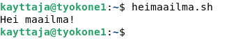

# h4 Omat komennot

Testaukset tehty VirtualBoxin (Version 6.1.26 r145957 (Qt5.6.2)) kautta Ubuntu 22.04 LTS sekä Debian 11 (Bullseye)-distroilla. Prosessorina Intel(R) Core(TM) i7-8700K CPU @ 3.70GHz

## a) Hei komento! Tee järjestelmään uusi "hei maailma" -komento ja asenna se orjille Saltilla. Liitä raporttiisi orjan 'ls -l /usr/local/bin/' tulosteesta ainakin se rivi, jolla näkyy uuden komentotiedostosi oikeudet.

Aloitin tekemällä kotihakemistooni kansion `scripts`, ja sinne tiedoston `heimaailma.sh`:

		~$ mkdir scripts
		~$ cd scripts/
		$ micro heimaailma.sh

Tämän jälkeen tallensin skriptitiedoston, tarkistin sen sisällön katenoimalla, tarkistin sen käyttäjäoikeudet ja lisäsin jokaiselle käyttäjälle suoritusoikeudet (+x). Tämän jälkeen vielä ajoin skriptin kerran:

Skripti vaikutti toimivalta, joten siirryin tekemään sille salt-tilaa. Tämän tein luomalla `/srv/salt/`-hakemistoon uuden hakemiston `simple_scripts`, ja luomalla sinne `init.sls`-staten. Statea varten tarvitsin myös tiedoston oikeuksien muokkauksen, tämän löysin saltin state_doc:ista etsimällä file.managed-kohdan esimerkkejä. Tiesin linuxin perusteista, että käyttäjäoikeuksia voidaan määritellä numeroin, joten yhden esimerkin mode-kohdan numerosarja '0644' vaikutti relevantilta. Sitten selvitin tarvittavat oikeudet aiemmin tekemästäni `heimaailma.sh`-tiedostosta:

		$ stat ~/scripts/heimaailma.sh

Tulosteen kohdasta access näki tiedoston oikeudet -` 0755/-rwxr-xr-x`

		~$ sudo mkdir /srv/salt/simple_scripts
		~$ cd /srv/salt/simple_scripts
		$ sudo micro init.sls

		/usr/local/bin/simple_scripts:
		  file.managed:
		    - source: salt://simple_scripts/heimaailma.sh
		    - mode: '0755'

Tallensin tiedoston ja kopioin `heimaailma.sh`-skriptin saltin kansioon (source://salt-viittaa /srv/saltin-hakemistoon, eli tiedoston tulee olla siellä):

		$ sudo cp ~/scripts/heimaailma.sh /srv/salt/simple_scripts/
		$ ls /srv/salt/simple_scripts/
		heimaailma.sh  init.sls

Sitten kokeilin ajaa staten:

		$ sudo salt '*' state.apply simple_scripts

Minionilla scriptiä testatessani huomasin tehneeni pienen virheen staten luonnissa. `heimaailma.sh` sijaan olin luonut tiedoston `simple_scripts`, jonka sisältö oli sama kuin `heimaailma.sh`:n

Korjasin tilanteen muokkaamalla `/srv/salt/simple_scripts/init.sls`-tiedostoa siten, että ensimmäiselle riville vaihdoin `simple_scripts` tilalle `heimaailma.sh`. Sitten ajoin tilan uudestaan, ja skripti toimi orjilla halutulla tavalla:

## b) whatsup.sh. Tee järjestelmään uusi komento, joka kertoo ajankohtaisia tietoja; asenna se orjille. Vinkkejä: Voit näyttää valintasi mukaan esimerkiksi päivämäärää, säätä, tietoja koneesta, verkon tilanteesta...

Tein komennon `~/scripts/`-hakemistoon `micro whatsup.sh`-komennolla.

		~$ cd /scripts
		$ micro whatsup.sh

		#!/usr/bin/bash
		
		echo -n "Hei "
		hostname -s
		echo "Tämänhetkinen päivämäärä ja aika on: "
		date

Tallensin tiedoston, muutin oikeudet `chmod ugo+x whatsup.sh` ja ajoin skriptin testiksi paikallisesti:

## c) hello.py. Tee järjestelmään uusi komento Pythonilla ja asenna se orjille. Vinkkejä: Hei maailma riittää, mutta propellihatut saavat toki koodaillakin. Shebang on "#!/usr/bin/python3". Helpoin Python-komento on: print("Hei Tero!")

Kuten aiemmin, loin skriptitiedoston `~/scripts`-hakemistoon. Vaihdoin oikeudet ja ajoin skriptin paikallisesti:

## d) Laiskaa skriptailua. Tee kansio, josta jokainen skripti kopioituu orjille.

Kopioin aiemmin luodut skriptit `/srv/salt/simple_scripts/scripts`-hakemistoon, jonka loin skriptien säilöntää varten:

		$ sudo mkdir /srv/salt/simple_scripts/scripts
		$ sudo cp -r ~/scripts/ /srv/salt/simple_scripts/
		$ ls -l /srv/salt/simple_scripts/scripts/
		total 12
		-rwxr-xr-x 1 root root  37 marras 22 18:18 heimaailma.sh
		-rwxr-xr-x 1 root root  49 marras 22 18:18 hello.py
		-rwxr-xr-x 1 root root 101 marras 22 18:18 whatsup.sh

Tiedostot olivat nyt hakemistossa. Sitten muutin `/srv/salt/init.sls`-tiedostoa siten, että se vie koko kansion sisällön orjille:
		             
		/usr/local/bin/:
		  file.recurse:
		    - source: salt://simple_scripts/scripts/    
		    - file_mode: '0755'

file_mode on tärkeä muutos - file.recursen kanssa pelkkä mode ei riitä. Sitten ajoin salt-tilan uudestaan kuten a-kohdassa:

		$ sudo salt '*' state.apply simple_scripts
		good_debian:
		----------
		          ID: /usr/local/bin/
		    Function: file.recurse
		      Result: True
		     Comment: Recursively updated /usr/local/bin/
		     Started: 18:25:34.881313
		    Duration: 128.053 ms
		     Changes:   
		              ----------
		              /usr/local/bin/hello.py:
		                  ----------
		                  diff:
		                      New file
		                  mode:
		                      0755
		              /usr/local/bin/whatsup.sh:
		                  ----------
		                  diff:
		                      New file
		                  mode:
		                      0755
		
Salt lupasi tehneensä muutokset, tarkastin etukäteen yhdellä orjalla skriptin toimimattomuuden ja uusien skriptien toimivuuden salt-tilan ajon jälkeen:

Kaikki kolme skriptiä toimi! (Toki heimaailma.sh oli säädetty toimimaan jo aiemmin, mutta se toimi jatkossakin)

## e) Intel. Etsi kolme loppuprojektia joltain vanhalta kurssitoteutukselta. Kuvaile projektit tiiviisti, viittaa ja linkitä alkuperäiseeen raporttin. Tässä alakohdassa ei tarvitse vielä kokeilla mitään koneella, vaan voit kuvailla niitä oheismateriaalin perusteella.

### [Sanna Jyrinki: Django tuotantoympäristö SaltStackilla](https://github.com/jyrinsan/hh_saltproject)

* [Django](https://www.djangoproject.com/) on avoimen lähdekoodin tuotantoympäristö.
* Moduuli asentaa Djangon, apachen, tulimuurin, postgresql-tietokannan sekä pienempiä sovelluksia:
      - micro
      - bash-completion
      - pwgen
      - tree
      - curl
* Nykyversio käyttää sqlite3-kantaa, joka ilmeisesti tulee djangon mukana vakiona
* Sisältää myös asetuksien säätöä ufw-tulimuurille, apachelle ja djangolle

### [Caius Juvonen: PyChess SaltStackilla](https://caiusinfo.data.blog/2020/05/19/palvelinten-hallinta-laksyt-viikko-7-caius-juvonen/)

* Moduuli asentaa PyChessin orjille ja säätää oletusasetuksista pois turhat helpotukset
* Sisältää hyvän ohjeen findin käyttöön säätöjen tekemistä varten
* Lisää myös peliin oman custom-äänen

### [Visual Boy Advanced (Miko Hirvelä)](https://github.com/mikohir/Palvelinten-hallinta/blob/main/H7.md)

* Asentaa Visual Boy Advanced-emulaattorin Saltilla
* Asentaa käyttöjärjestelmän mukaan eri ROMit Pokemon-peleistä
* Tekee muutoksia oletusnäppäimiin

## e) Lukua, ei luottamusta. Kokeile yhtä kohdassa d-Intel löytämääsi modulia koneella. Tämä on infraa koodina, joten luottamusta ei tarvita. Voit lukea koodista, mitä olet ajamassa.

Ajoin Sanna Jyringin moduulin. Vaikka Django itsessään ei ollut itselleni kiinnostava, moduuli oli mielenkiintoinen ihan pienempienkin ohjelmien vuoksi (tree, curl, pwgen). Esimerkiksi masterillanikaan ei ollut curlia asennettuna ennen moduulin testausta. Huomasin koodia lukiessa, että appsit-hakemiston init.sls ei kuitenkaan asentanut luvattua curlia. Lisäsin sen init.sls-tiedostoon. En myöskään halunnut asentaa djangoa tai muuttaa tulimuurini asetuksia, joten kommentoin ne ulos top.sls-tiedostosta.

		~$ git clone git@github.com:jyrinsan/hh_saltproject.git
		~$ sudo cp -r ~/hh_saltproject/srv/salt/ /srv/
		$ sudo salt '*' state.apply
		$ sudoedit /srv/salt/appsit/init.sls
		appsit:
		  pkg.installed:
		    - pkgs:
		      - micro
		      - bash-completion
		      - pwgen
		      - tree
		      - curl
		      
		$ sudoedit /srv/salt/top.sls
		base:
		  '*':
		    - appsit
		#    - firewall
		    - postgresql
		    - apache
		#    - django
		#    - djangoproject
		    - crmapp

		$ sudo salt '*' state.apply

		good_boy:
		----------
		          ID: appsit
		    Function: pkg.installed
		      Result: True
		     Comment: The following packages were installed/updated: curl
		              The following packages were already installed: micro, bash-completion, pwgen, tree
		     Started: 20:49:40.641528
		    Duration: 13117.057 ms
		     Changes:   
		              ----------
		              curl:
		                  ----------
		                  new:
		                      7.81.0-1ubuntu1.6
		                  old:
		----------
		          ID: postgresql
		    Function: pkg.installed
		      Result: True
		     Comment: All specified packages are already installed
		     Started: 20:49:53.762767
		    Duration: 853.363 ms
		     Changes:   
		----------
		          ID: postgresql.service
		    Function: service.running
		      Result: True
		     Comment: The service postgresql.service is already running
		     Started: 20:49:54.617065
		    Duration: 15.028 ms
		     Changes:   
		----------
		          ID: apache2
		    Function: pkg.installed
		      Result: True
		     Comment: All specified packages are already installed
		     Started: 20:49:54.632232
		    Duration: 13.311 ms
		     Changes:   
		----------
		          ID: /var/www/html/index.html
		    Function: file.managed
		      Result: True
		     Comment: File /var/www/html/index.html is in the correct state
		     Started: 20:49:54.647072
		    Duration: 22.292 ms
		     Changes:   
		----------
		          ID: /etc/apache2/mods-enabled/userdir.conf
		    Function: file.symlink
		      Result: True
		     Comment: Symlink /etc/apache2/mods-enabled/userdir.conf is present and owned by root:root
		     Started: 20:49:54.669491
		    Duration: 1.545 ms
		     Changes:   
		----------
		          ID: /etc/apache2/mods-enabled/userdir.load
		    Function: file.symlink
		      Result: True
		     Comment: Symlink /etc/apache2/mods-enabled/userdir.load is present and owned by root:root
		     Started: 20:49:54.671143
		    Duration: 1.383 ms
		     Changes:   
		----------
		          ID: apache2.service
		    Function: service.running
		      Result: True
		     Comment: The service apache2.service is already running
		     Started: 20:49:54.673350
		    Duration: 14.495 ms
		     Changes:   
		----------
		          ID: /home/django/publicwsgi/myapp/db.sqlite3
		    Function: file.managed
		      Result: True
		     Comment: File /home/django/publicwsgi/myapp/db.sqlite3 is in the correct state
		     Started: 20:49:54.687960
		    Duration: 10.421 ms
		     Changes:   
		----------
		          ID: /home/django/publicwsgi/myapp/crm
		    Function: file.recurse
		      Result: True
		     Comment: The directory /home/django/publicwsgi/myapp/crm is in the correct state
		     Started: 20:49:54.698508
		    Duration: 144.371 ms
		     Changes:   
		
		Summary for good_boy
		-------------
		Succeeded: 10 (changed=1)
		Failed:     0
		-------------
		Total states run:     10
		Total run time:   14.193 s

Tilan ajaminen onnistui. Testasin toimivuutta tarkistamalla curlin ja apachen toimivuuden orjalla

"Tervetuloa Sannan Apachen Testisivulle" vaikuttaa lupaavasti siltä, että ainakin curl ja apachen testisivu on säädetty onnistuneesti.
